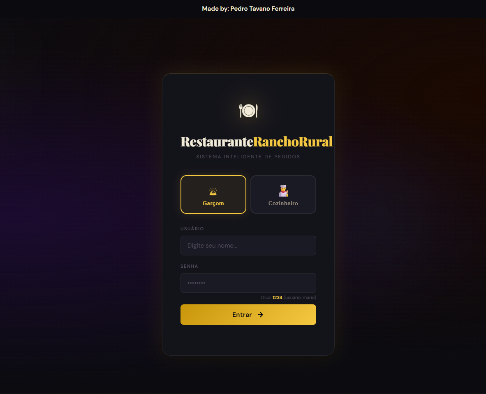
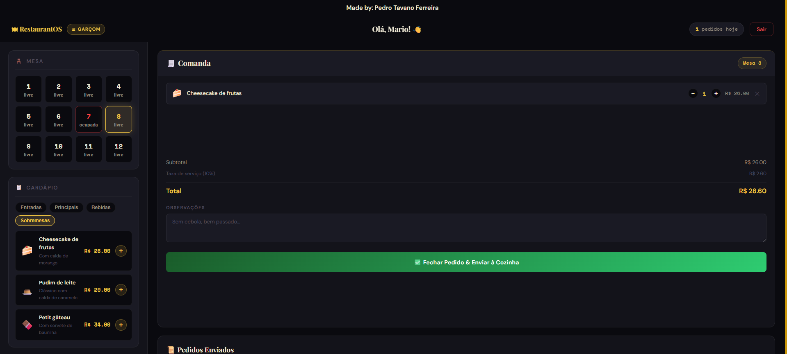
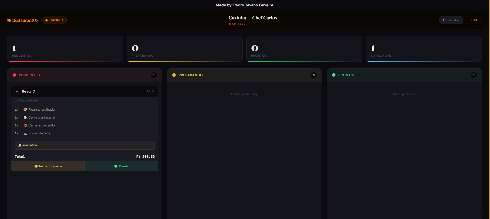

# 🍽️ RestaurantOS — Sistema Inteligente de Pedidos

> **Desenvolvido por:** Pedro Tavano Ferreira  
> **Stack:** HTML5 · CSS3 · JavaScript Vanilla  
> **Padrão UX:** Half Loop (feedback visual em tempo real)

---

## 📌 Sobre o Projeto

O **RestaurantOS** é um sistema web completo de gerenciamento de pedidos para o **Rancho Rural**, desenvolvido com HTML, CSS e JavaScript puro. Ele simula um ambiente real de restaurante com dois perfis de usuário — **Garçom** e **Cozinheiro** — comunicando-se em tempo real via `localStorage` (simulando multi-abas/multi-dispositivos).

O projeto implementa o padrão **Half Loop**, focado em micro-interações, feedback visual instantâneo e animações suaves para reduzir a percepção de latência e melhorar a experiência do usuário.

---

## 🖼️ Screenshots

### Tela de Login
> Tela inicial com seleção de perfil (Garçom ou Cozinheiro), fundo com orbs animados e overlay de ruído para textura visual.





---

### Tela do Garçom
> Painel principal com seleção de mesas, cardápio por categorias e comanda em tempo real com cálculo automático de totais.




---

### Tela da Cozinha (Kanban)
> Painel Kanban com três colunas: **Pendentes → Preparando → Prontos**. Atualização automática a cada 2 segundos e notificações de novos pedidos.




---

### Toast de Notificação
> Notificação visual animada que aparece na cozinha ao receber um novo pedido, com dados do garçom, mesa e total.


---

## ⚙️ Funcionalidades

### 👤 Autenticação
- Login por perfil: **Garçom** ou **Cozinheiro**
- Credenciais de demonstração pré-cadastradas
- Validação de campos e mensagens de erro visuais
- Hint de senha visível na tela de login

### 🛎️ Módulo do Garçom
- Visualização de **12 mesas** com status livre/ocupada
- Cardápio dividido em 4 categorias: Entradas, Principais, Bebidas, Sobremesas
- Comanda interativa com controle de quantidade (+/-)
- Cálculo automático de subtotal, taxa de serviço (10%) e total
- Campo de observações por pedido
- Histórico de pedidos enviados na sessão

### 👨‍🍳 Módulo da Cozinha
- **Kanban em tempo real** com 3 colunas de status
- Polling automático a cada **2 segundos**
- Sincronização entre abas via `localStorage` (evento `storage`)
- **Toast animado** ao receber novos pedidos
- **Notificações nativas do browser** (Notification API)
- Estatísticas rápidas: pendentes, preparando, prontos, total do dia
- Botões de ação por pedido: "Iniciar preparo" e "Marcar como pronto"

---

## 🔄 Fluxo do Sistema

```
┌─────────────────────────────────────────────────────┐
│                   TELA DE LOGIN                      │
│   Seleciona perfil → Insere credenciais → Entra      │
└───────────────┬─────────────────────┬───────────────┘
                │                     │
        ┌───────▼──────┐     ┌────────▼──────┐
        │   GARÇOM     │     │   COZINHEIRO  │
        │              │     │               │
        │ 1. Seleciona │     │ Visualiza     │
        │    mesa      │     │ Kanban ao     │
        │ 2. Adiciona  │     │ vivo          │
        │    itens     │     │               │
        │ 3. Fecha     │────▶│ Pendente →    │
        │    pedido    │     │ Preparando →  │
        │              │     │ Pronto        │
        └──────────────┘     └───────────────┘
                  ↑_______________|
             localStorage (tempo real)
```

---

## 🎨 Padrão Half Loop (UX)

O projeto implementa o padrão **Half Loop** para melhorar a experiência do usuário:

| Ação | Feedback Visual |
|------|----------------|
| Selecionar mesa | Pulse animado no botão |
| Adicionar item | Animação `adding-item` no card |
| Fechar pedido | Botão muda para "🔄 Processando..." → "✅ Enviado!" |
| Mover pedido (cozinha) | Pulse no card com nova cor de status |
| Erro (sem mesa) | Botão flash vermelho com mensagem |
| Novo pedido recebido | Toast desliza da direita + notificação browser |

---

## 🗂️ Estrutura de Arquivos

```
ia-claude-llm-sonnet-vscode/
├── Index.html          # Estrutura HTML (3 telas: login, garçom, cozinha)
├── style.css           # Estilos, animações e tema dark/gold
├── app.js              # Lógica completa da aplicação
└── CLAUDE.md           # Documentação do padrão Half Loop
```

---

## 🚀 Como Executar

1. **Clone ou baixe** os arquivos do projeto
2. Abra o arquivo `Index.html` diretamente no navegador
3. Não requer servidor — funciona 100% no browser

```bash
# Opcionalmente, com Live Server (VS Code):
# Clique com botão direito em Index.html → "Open with Live Server"
```

> 💡 **Dica:** Para simular a comunicação Garçom ↔ Cozinha, abra duas abas no mesmo navegador — uma logada como garçom e outra como cozinheiro.

---

## 🔐 Credenciais de Demonstração

| Perfil | Usuário | Senha |
|--------|---------|-------|
| Garçom | `mario` | `1234` |
| Garçom | `joao` | `1234` |
| Cozinheiro | `chef` | `1234` |
| Cozinheiro | `lucas` | `1234` |

---

## 🍽️ Cardápio Disponível

| Categoria | Itens |
|-----------|-------|
| 🥗 Entradas | Salada Caesar, Camarão ao ajillo, Tábua de frios |
| 🥩 Principais | Picanha grelhada, Fettuccine Carbonara, Salmão, Frango parmegiana |
| 🍺 Bebidas | Cerveja artesanal, Vinho tinto, Suco natural, Água mineral |
| 🍰 Sobremesas | Cheesecake, Pudim de leite, Petit gâteau |

---

## 🛠️ Tecnologias Utilizadas

- **HTML5** — Estrutura semântica com 3 seções/telas
- **CSS3** — Variáveis CSS, animações `@keyframes`, Flexbox/Grid, tema dark
- **JavaScript ES6+** — Módulos, `localStorage`, `setInterval`, Notification API
- **Google Fonts** — Playfair Display, DM Sans, Space Mono
- **Padrão Half Loop** — Micro-interações e feedback visual em tempo real

---

## 📝 Observações

- O sistema **não requer backend** — toda a comunicação é feita via `localStorage`
- O polling da cozinha ocorre a cada **2 segundos** para simular tempo real
- As **notificações nativas do browser** são solicitadas ao entrar na tela de cozinha
- O projeto foi desenvolvido e documentado com suporte do **Claude (Anthropic)**

---

*RestaurantOS © 2025 — Pedro Tavano Ferreira*
